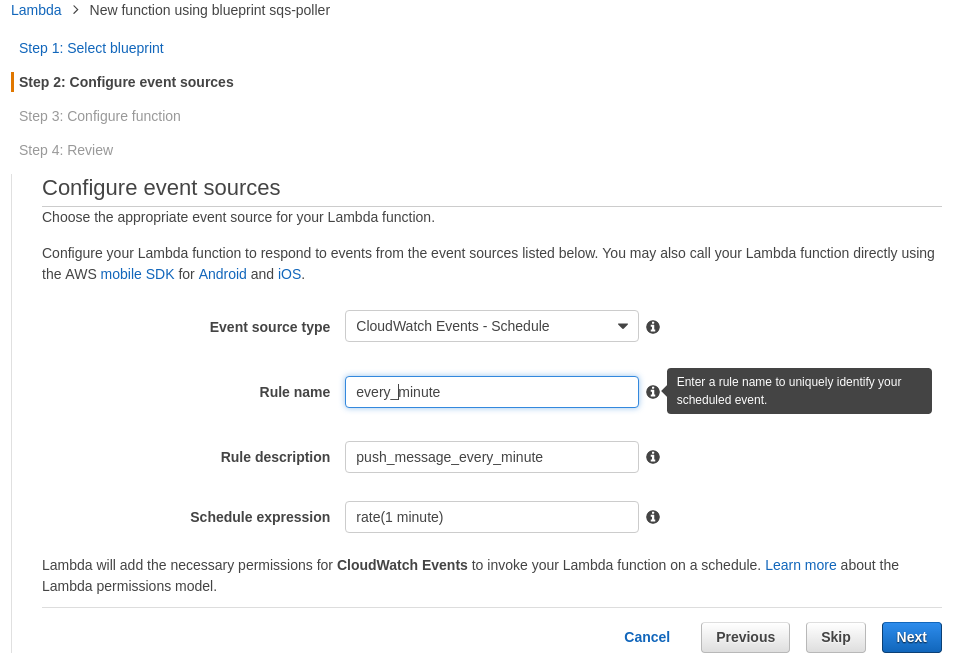
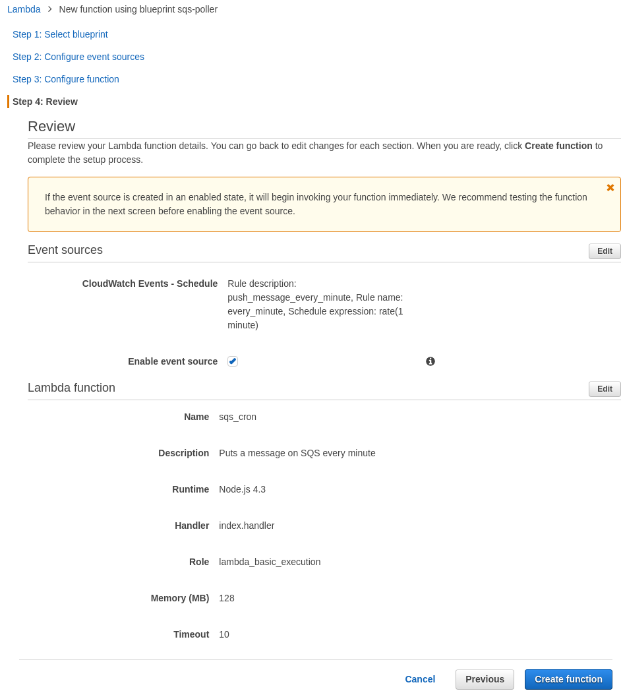
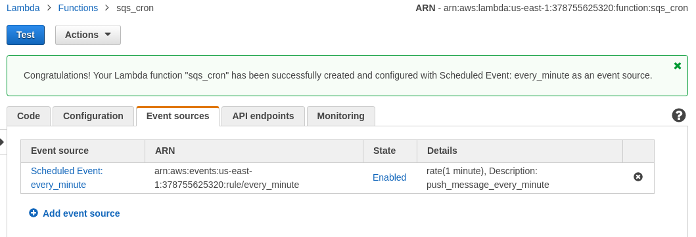

# Replacing Cron with AWS Lamda


We're running a mix of [AWS Elastic Beanstalk](https://aws.amazon.com/elasticbeanstalk/) along with some random [EC2's](https://aws.amazon.com/ec2/), [SQS](https://aws.amazon.com/sqs/), [RDS](https://aws.amazon.com/rds/) and a few other things at work.

Currently we have some [Cron](https://en.wikipedia.org/wiki/Cron) running on these EC2's which bothers me as if these servers fail we need to re-instate it. Sure we are using [Ansible](https://www.ansible.com/) to make re-installation a breeze but it still doesn't feel right to me and we're probably spending a bit too much money because these servers are idle while they're not doing their timed tasks.

I am a regular attendee at [LNUG](http://lnug.org) and the last few meetings have had some good coverage about AWS Lambda so I thought it was about time I started catching up! So My weekend investigation is going to be to seeing if I could get Lamda running Cron related tasks.

I did the pointy clicky process in the [AWS console](https://aws.amazon.com/console/) and had a Lamda putting items into an SQS queue... It was pretty easy and it worked... Awesome!

I'm going to come back and show you how to do this in a proper automated / [idempotent](http://stackoverflow.com/questions/1077412/what-is-an-idempotent-operation) way but firstly this is how you do it in the UI.

## Manual Version

### Getting Started

Firstly click the "Get Started Now" button on the initial Lambda screen (the header image above), this will take you into a simple wizard like interface as seen below.

### Picking a BluePrint


We use a lot of SQS queues and for now, while I'm just dipping my toes into Lambda I will have the actual work carried out by a worker and just use Lambda kick it off when the time comes. So the task becomes putting an item into an SQS queue when the correct time comes. Because of this I picked something that would bring in the required AWS libraries as a starting point to base my code on.

### Scheduling



This is where the Cron bit comes in, note the fact it comes from Cloudwatch that is important later. You can also put full Cron lines in there but the syntax is [slightly strange](https://docs.aws.amazon.com/AmazonCloudWatch/latest/DeveloperGuide/ScheduledEvents.html#CronExpressions).

### The Code


Now we get to write some code. There is support for rudimentary testing etc in the UI but I wouldn't want to do development here... I read breifly about the "Role" and it sounds really interesting but it is a bit too opaque for me right now to write about... For the time being I just created one based on "Basic execution role".

For the observant people did you notice there are no credentials for writing to the SQS queue? I suspect this is because of the Role, I will need to come back and investigate this, perhaps in a different blog post.

### Ready to Deploy!



Push the button!

## The Automated / Idempotent Way.

### The tools

After my [investigations](http://keyboardwritescode.blogspot.com/2016/04/investigating-hashicorp-terraform.html) into [HashiCorp's Terraform](http://www.terraform.io/) I became a real fan and when I saw that Terraform includes a bunch of functions related to Lamda I knew it would be the tool of choice... However getting them going took a little bit of experimentation...

### The problems

My biggest problem was that I associated the scheduled running of a Lambda with the Lambda product itself as you configure it within the wizard when doing it manually. Seems this is not really the case and attempting to use [`aws_lambda_event_source_mapping`](https://www.terraform.io/docs/providers/aws/r/lambda_event_source_mapping.html) got me nowhere.

### The solution

Eventually I found that the schedule exists in Cloudwatch, which seems a bit non-obvious to me but in any case once I found this out I started exploring Terraform's [`aws_cloudwatch_event_rule`](https://www.terraform.io/docs/providers/aws/r/cloudwatch_event_rule.html) and [`aws_cloudwatch_event_target`](https://www.terraform.io/docs/providers/aws/r/cloudwatch_event_rule.html) as a way to fire the function. It turned out that no matter what I could do I could not get it to show in "Event Sources" in the console as shown below:



The missing part of the puzzle was permissions in the form of [`aws_lambda_permission`](https://www.terraform.io/docs/providers/aws/r/lambda_permission.html) and once I added this it all worked well and items were appearing in my SQS queue.

### What I achieved

Seems my weekend work has acheived something awesome as:

 * We can now remove an instance that just runs Cron, saving a small amount of money and saving the planet.
 * We've given the job of ensuring it all keeps running to AWS so we no longer need to worry so much about the Cron machine going down and us not noticing.

### What does the finished solution look like?

The basics are:

 * A zip file including just one JavaScript file which is the code in the screenshot above.
 * A JSON file containing the AWS IAM Role, because I don't like HEREDOC's very much.
 * The Terraform file itself as seen below

```
variable "aws_profile" {}

provider "aws" {
    profile = "${var.aws_profile}"
    region = "us-east-1"
}

resource "aws_iam_role" "iam_for_lambda" {
    name = "iam_for_lambda"
    assume_role_policy = "${file("./iam_for_lamda.json")}"
}

resource "aws_cloudwatch_event_rule" "fire_every_minute" {
    name = "fire_every_minute"
    schedule_expression = "cron(* * * * ? *)"
}

resource "aws_lambda_function" "fire_every_minute" {
    filename = "./minutely_push_to_sqs.zip"
    function_name = "fire_every_minute"
    handler = "index.handler"
    runtime = "nodejs4.3"
    role = "${aws_iam_role.iam_for_lambda.arn}"
}

resource "aws_cloudwatch_event_target" "fire_every_minute" {
  rule = "${aws_cloudwatch_event_rule.fire_every_minute.name}"
  arn = "${aws_lambda_function.fire_every_minute.arn}"
}

resource "aws_lambda_permission" "allow_cloudwatch" {
    statement_id = "AllowExecutionFromCloudWatch"
    action = "lambda:InvokeFunction"
    function_name = "${aws_lambda_function.fire_every_minute.arn}"
    principal = "events.amazonaws.com"
    source_arn = "${aws_cloudwatch_event_rule.fire_every_minute.arn}"
}
```

To run it, all you need to do is put a (or the) JS file within a zip file and run `terraform apply -var aws_profile=$AWS_DEFAULT_PROFILE` and it will deploy everything for you.

### Where's the source?

The source for everything is on [GitHub](https://github.com/forbesmyester/aws-lambda-cron).
